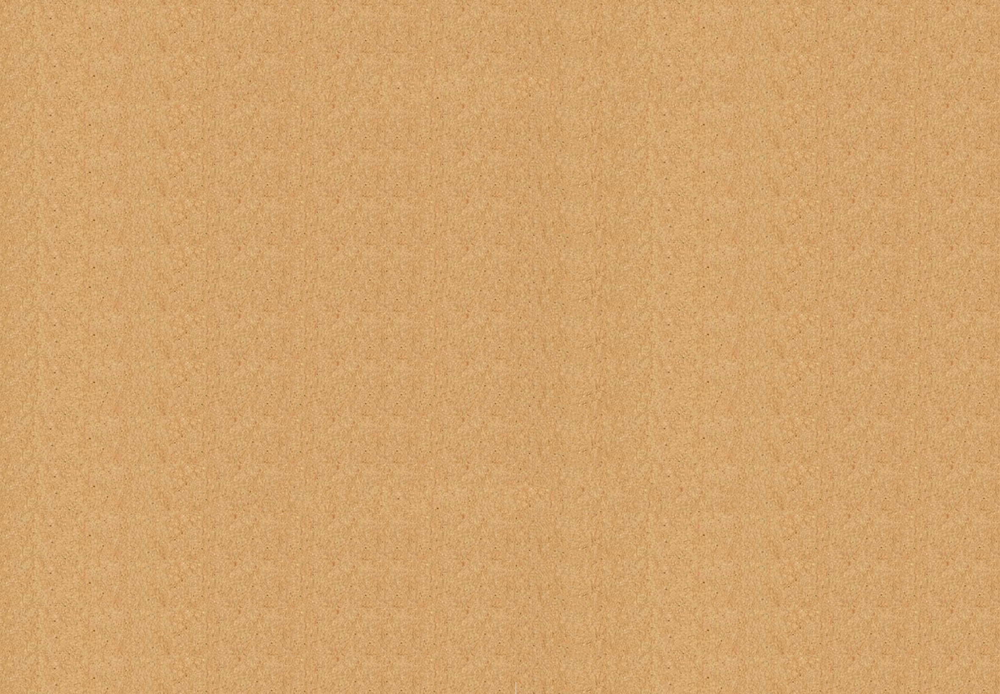

# ✂️ Rock Paper Scissors (RPS)

**A fully functional, interactive game of Rock Paper Scissors built to solidify fundamental JavaScript DOM manipulation and game logic.**

[](#[Technologies-Used])
[](#[Technologies-Used])
[](#[Technologies-Used])
[](LICENSE)

## 📸 Demo

https://cooleditingx.github.io/odin-rps/index.html
A visual demonstration of the game interface and interaction.




> The main interface where the player selects a move (Rock, Paper, or Scissors).

***

## 📖 Description

The **Rock Paper Scissors** project is a core exercise focused on building interactive web applications using pure JavaScript. The goal was to program the game logic, handle user input via the DOM, and update the interface dynamically based on the game's outcome.

The application pits the user against a randomized computer opponent over a series of rounds, tracking and displaying the score in real-time until a final winner is declared.

***

## 💻 Local Setup & Usage

Since this is a client-side web application, no servers or build environments are necessary.

### How to Copy it for Your Own Computer

1.  **Clone the Repository:**
    Open your terminal or command prompt and clone the project:
    ```bash
    git clone [https://github.com/cooleditingx/odin-rps.git](https://github.com/cooleditingx/odin-rps.git)
    cd odin-rps
    ```

2.  **Open and Play:**
    Locate the main HTML file (`index.html` or `game.html`) and open it directly in your web browser.
    ```bash
    open index.html # For macOS/Linux
    # OR
    start index.html # For Windows
    ```

### How to Use it

* Click on one of the three options (Rock, Paper, or Scissors) to play a round.
* The game logic will calculate the winner of the round (Player vs. Computer).
* The score is automatically updated on the screen.

***

## ✨ Features

This implementation of Rock Paper Scissors includes the following features:

* 🤖 **Randomized CPU Choice:** The computer's move is determined randomly for an unpredictable challenge.
* 📊 **Score Tracking:** Displays the current score for both the player and the computer.
* 📢 **Real-Time Feedback:** Provides immediate text or visual feedback after each round, declaring the winner.
* 🎮 **Game End Condition:** Tracks the score until one player reaches a predetermined winning total, announcing the final victor.
* 🎨 **Custom Typography:** Utilizes custom fonts (`Game of Squids`) for a unique aesthetic.

***

## 🛠️ Technologies Used

This project was developed using the fundamental building blocks of front-end web development:

| Technology | Role |
| :--- | :--- |
| **HTML5** | Defines the game structure and user interface elements. |
| **CSS3** | Styles the game, including layout, colors, and visual presentation. |
| **JavaScript (ES6+)** | Handles all interactive game logic, scorekeeping, and DOM manipulation. |
